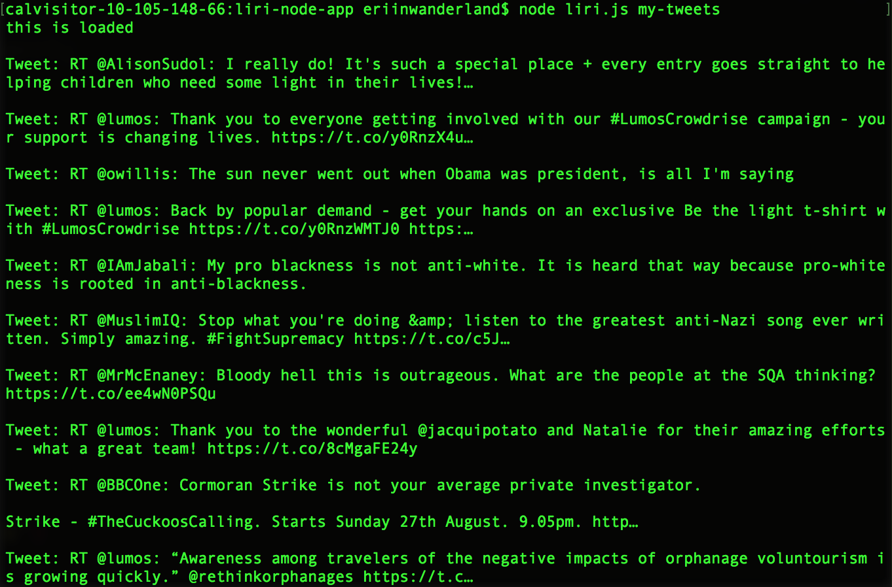

# LIRI Node App

	A SIRI like app using node to search movies, songs, and tweets based on your command!  

	Below are screenshots of the app: 

	For information about a movie, run the command: 

	"movie-this" followed by a movie and receive information from OMDB about the film!

	"my-tweets" and receive tweets by the wonderful J.K. Rowling!

	"spotify-this" followed by a song and receive information from Spotify about the song!

	"do-what-it-says" and receive information about the classic head banger, "I Want It That Way"!

## Contributor

	Eri Nagase

## Technologies Used
	
	Javascript

	node

	API
		Twitter
		Spotify
		OMDB

## License
	Copyright 2017 UC Berkeley Extension Coding Bootcamp - Eri Nagase